# Writer Block - Core Architecture Documentation

## Overview

Writer Block is a Chrome extension that provides AI-powered writing assistance on any web-based text editor. It uses browser-native APIs to reliably modify text content and trigger auto-save mechanisms across different platforms.

## Project Structure

```
write-assist/
├── extension/
│   └── chrome-extension/
│       ├── manifest.json          # Extension configuration
│       ├── content.js             # Main content script
│       ├── background.js          # Background service worker
│       ├── popup.html            # Extension popup UI
│       ├── popup.js              # Popup functionality
│       ├── styles.css            # Custom styles
│       └── README.md             # Extension documentation
├── docs/
│   └── core_architecture.readme.md  # This file
└── backend/                      # Future AI backend (planned)
```

## Core Architecture

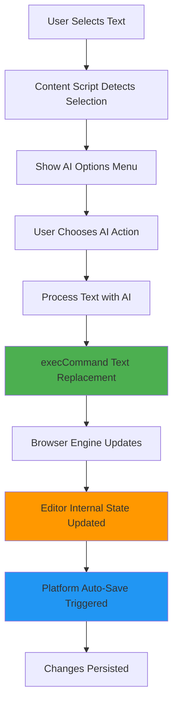

## Technical Deep Dive

### 1. Text Selection Detection

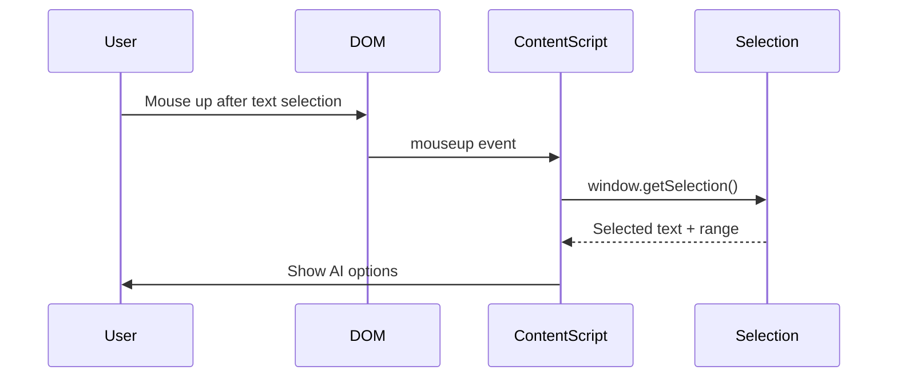

### 2. AI Processing Flow

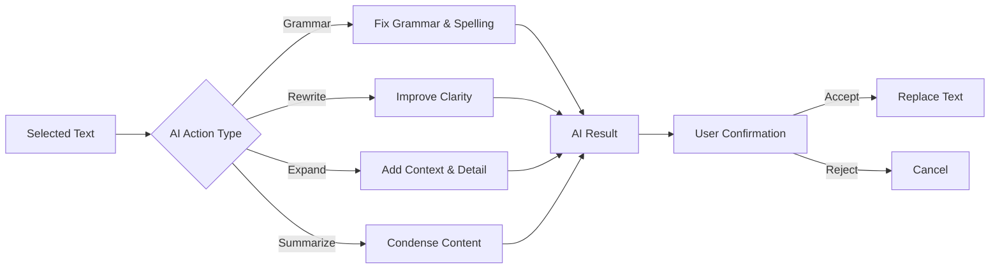

### 3. Text Replacement Mechanism

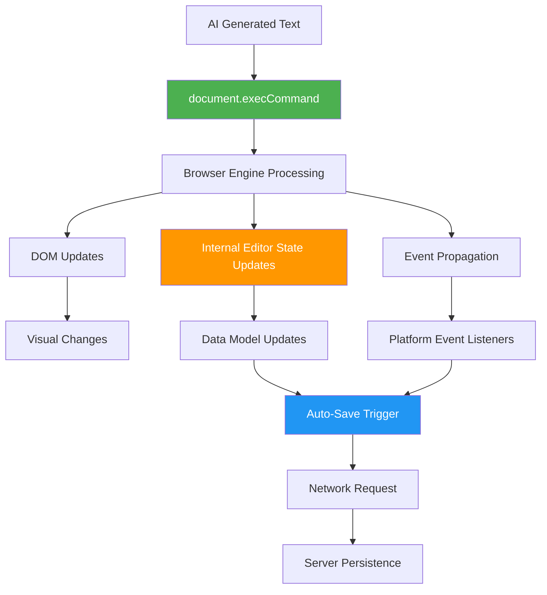

## Why execCommand Works

### The Problem with Custom Events


### The execCommand Solution


## Platform Compatibility

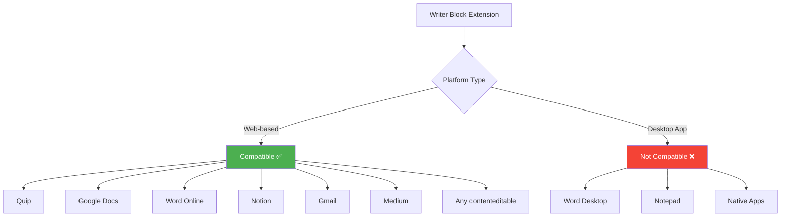

## Event Flow Analysis

### Normal User Typing

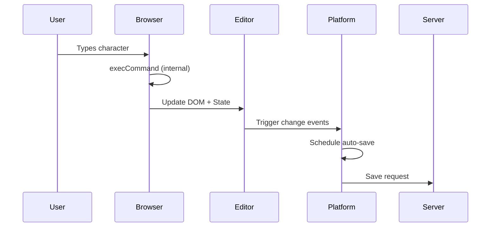

### Extension Text Replacement

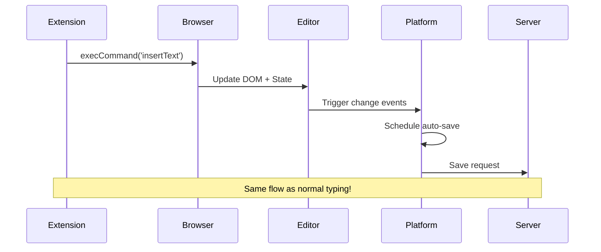

## Key Technical Insights

### 1. Why Other Methods Failed

| Method | DOM Update | Internal State | Auto-Save | Persistence |
|--------|------------|----------------|-----------|-------------|
| Direct DOM manipulation | ✅ | ❌ | ❌ | ❌ |
| Custom InputEvent | ✅ | ❌ | ❌ | ❌ |
| Keyboard simulation | ✅ | ❌ | ❌ | ❌ |
| **execCommand** | ✅ | ✅ | ✅ | ✅ |

### 2. Browser Engine Integration

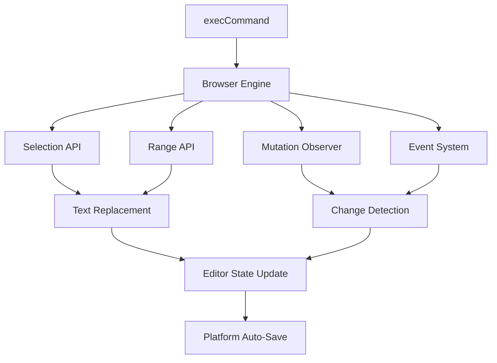

### 3. Cross-Platform Reliability

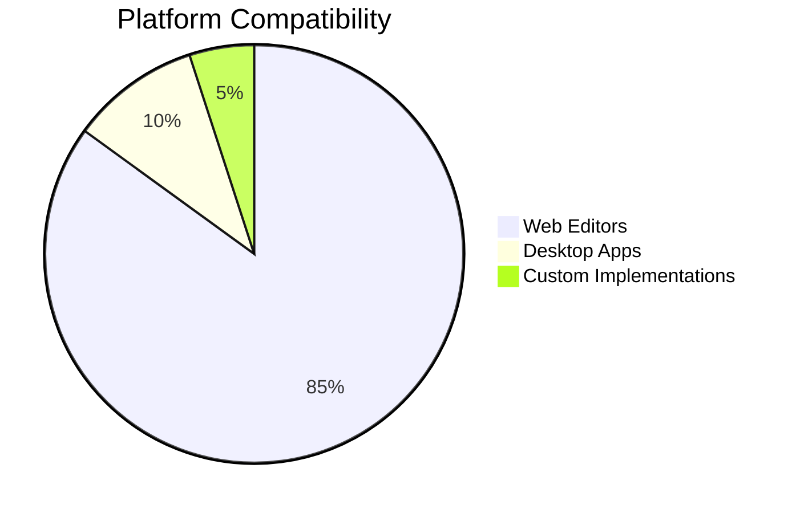

## Implementation Details

### Core Function

```javascript
function replaceSelectedText(newText) {
  const selection = window.getSelection();
  
  if (selection.rangeCount === 0) {
    return false;
  }
  
  try {
    // Browser-native text replacement
    const success = document.execCommand('insertText', false, newText);
    return success;
  } catch (error) {
    console.error('Text replacement failed:', error);
    return false;
  }
}
```

### Why This Works

1. **Browser Native**: Uses browser's built-in text editing system
2. **State Synchronization**: Automatically updates internal editor state
3. **Event Propagation**: Triggers all necessary change events
4. **Undo/Redo**: Maintains editing history
5. **Selection Handling**: Properly manages text selection and cursor

## Future Architecture

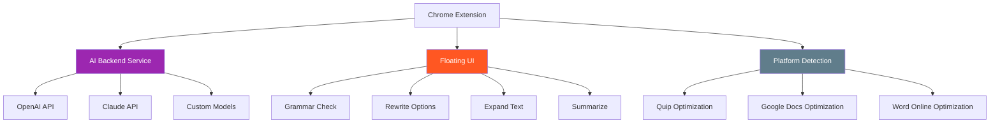

## Security Considerations


## Performance Characteristics

### Memory Usage
- **Low**: Minimal DOM manipulation
- **Efficient**: Uses browser-native APIs
- **Clean**: No event listener pollution

### Processing Speed
- **Fast**: Direct browser engine integration
- **Reliable**: Consistent across platforms
- **Scalable**: Works with any text length

## Debugging and Monitoring

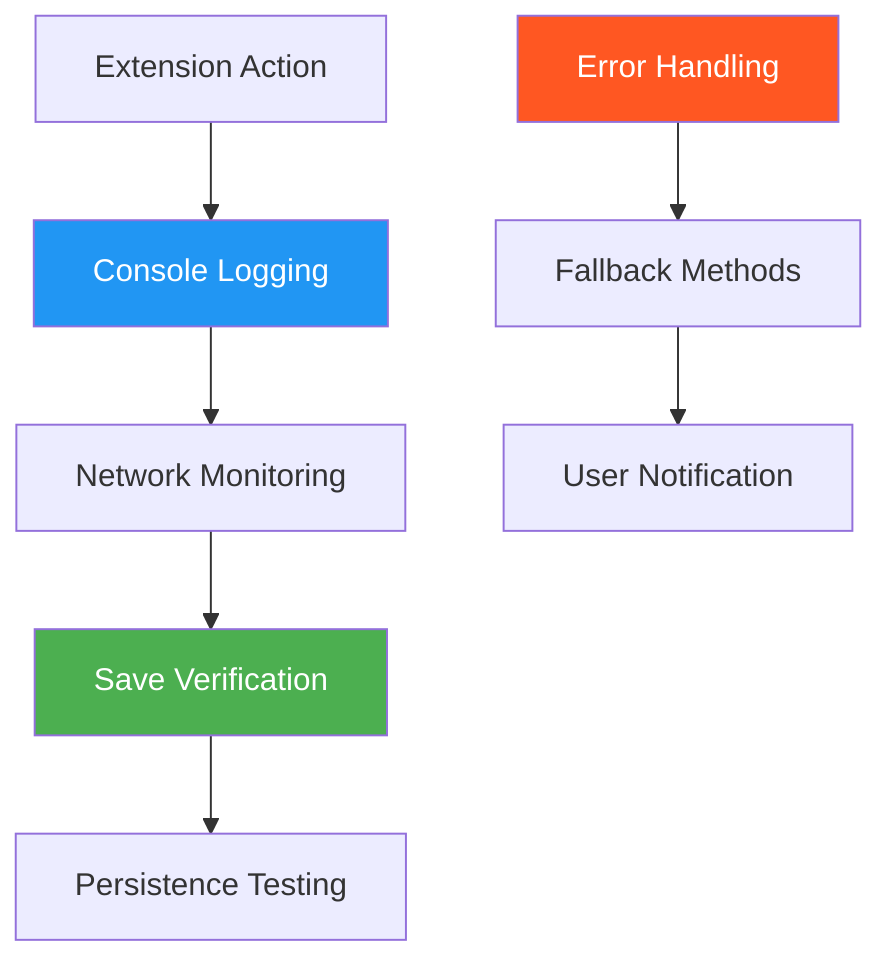

## Conclusion

The Writer Block extension successfully solves the challenge of programmatic text editing in web applications by leveraging the browser's native `execCommand` API. This approach ensures:

- **Universal compatibility** with web-based editors
- **Reliable persistence** through proper state management
- **Seamless integration** with existing auto-save mechanisms
- **Future-proof architecture** for AI integration

The key insight is that modern web editors require **browser-level integration** rather than just DOM manipulation to achieve reliable text replacement with persistence.
